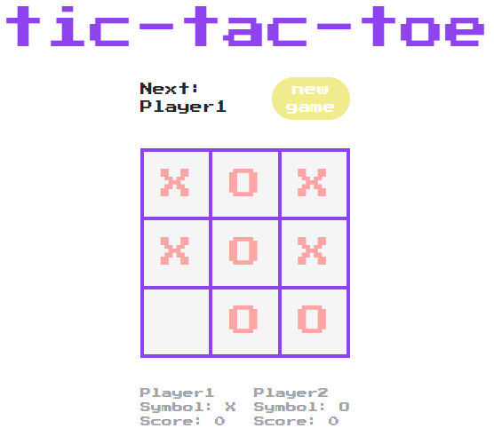

# Tic Tac Toe Game

## Table of Contents

- [Introduction](#introduction)
- [Types](#types)
- [Utility Functions](#utility-functions)
- [Styles](#styles)
- [DOM Elements](#dom-elements)
- [Players](#players)
- [Game Initialization](#game-initialization)
- [Game Logic](#game-logic)
- [Display Functions](#display-functions)
- [Creating the Grid](#creating-the-grid)
- [Resetting the Grid](#resetting-the-grid)
- [Running the Game](#running-the-game)

## Introduction

Welcome to the documentation for the Tic Tac Toe game project. This project is a simple implementation of the classic Tic Tac Toe game using HTML, CSS, and JavaScript. This documentation provides an overview of the project's structure and functionality.

## Types

- `Coordinates`: [number, number]
- `Player`: { name: string, symbol: "X" | "O", score: number }
- `CellState`: { markedBy: string | null, element: Element }

## Utility Function

- `coordToId(coord: Coordinates): string`

## Styles

- `gridCellStyling`: CSS classes for grid cells
- `gridStyling`: CSS classes for the grid container
- `playerInfoStyling`: CSS classes for player information

## DOM Elements

- `gameGrid`: Grid container
- `currentPlayerElement`: Current player display
- `currentScorePlayers`: Player information display
- `resetButton`: Reset button

## Players

- Player objects: Player1 (X) and Player2 (O)

## Game Initialization

- Initial values for `turn` and `gameEndState`
- Display the current player's name
- Display player information

## Game Logic

- `didWin`: Check win conditions
- `displayWinner`: Display the winning player
- Event listeners for player moves
- Players take turns and mark cells

## Display Functions

- `infoPlayersDisplay`: Display player information
- `displayWinner`: Display the winning player

## Creating the Grid

- `makeMyGrid`: Create the game grid dynamically
- Attach event listeners to cells for player moves

## Resetting the Grid

- `resetGrid`: Reset the game grid, scores, and game state

Enjoy playing Tic Tac Toe!